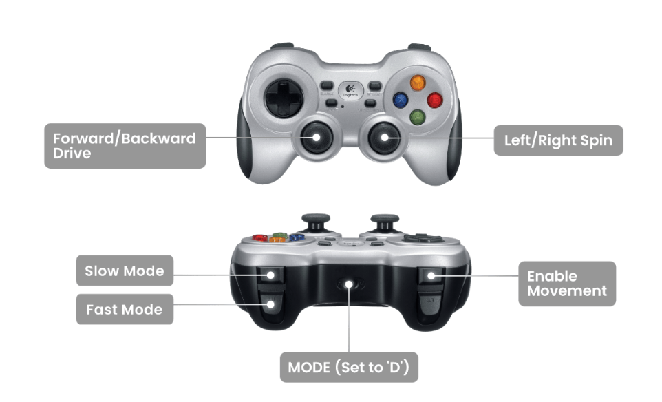

# 🛸 Crazyflie Leader–Follower System (ROS2)

This repository contains multiple scripts for simulating or executing a **leader–follower** drone system using the **Crazyflie** and **Crazyswarm2** libraries in **ROS 2**. The system supports:

* Predefined waypoint or circular trajectory tracking
* Real-time following using **Kalman filter (EKF)** pose estimation
* Manual joystick control using a **Logitech F710** joystick

---

## 📁 Scripts Overview

| Script                 | Description                                                                 |
| ---------------------- | --------------------------------------------------------------------------- |
| `run.py`               | Standard leader–follower mission with predefined waypoints                  |
| `run_ekf.py`           | Uses EKF pose estimation if motion capture is unavailable                   |
| `run_joy.py`           | Enables joystick control (e.g. Logitech F710) for leader                    |
| `run_traj.py` | Generates and visualizes circular trajectories for leader–follower missions |

---

## 🧩 Dependencies

Ensure the following are installed:

* ROS 2 (Humble or newer)
* `crazyflie_py`, `crazyflie_interfaces`, `geometry_msgs`, `sensor_msgs`
* `numpy`, `matplotlib` (for trajectory visualization)

---
## Installation process:
Ros2 requirements:
```bash
sudo apt install ros-humble-rclpy
sudo apt install ros-humble-geometry-msgs
sudo apt install ros-humble-sensor-msgs
sudo apt install ros-humble-crazyflie-interfaces
```

Since this is a custom package from crazyswarm2:
```bash
cd ~/ros2_ws/src
git clone https://github.com/IMRCLab/crazyflie_ros2.git
cd ..
colcon build
source install/setup.bash
```
```bash
git clone https://github.com/andyyounes/Crazyflie-leader-follower
cd Crazyflie-leader-follower
```
Make sure you have the installation requirements:
```bash
pip install -r requirements.txt
```

```bash
cd ~/ros2
sudo apt install ros-humble-joy
```

Please follow the link below for steps to make sure your logitech F710 console is ready:
Please follow [this guide](https://husarion.com/tutorials/ros-equipment/gamepad-f710/) to make sure your Logitech F710 console is ready.


## ⚙️ Setup Instructions
Terminal 1:
1. **Source ROS 2 setup files**:

   ```bash
   source install/setup.bash
   ```
Terminal 2:
2. **Launch Crazyswarm2 backend (sim)**:

   ```bash
   ros2 launch crazyflie launch.py rviz:=True backend:=sim
   ```
   ** or real **:
  ```bash
   ros2 launch crazyflie launch.py rviz:=True 
   ```
Terminal 3:
4. **Run a desired script (sim)**:

   ```bash
   ros2 run crazyflie_leader_follower run --ros-args -p use_sim_time:=True
   ```
  ** or real **:
  ```bash
   ros2 run crazyflie_leader_follower run
  ```
---

## 🧭 Usage Guide

### 1. `run.py` – Simple Leader–Follower with Waypoints

* Drone 1 (leader) takes off and visits 5 fixed waypoints.
* Drone 2 (follower) takes off and follows the leader at an offset (`x -0.3`).
* Landing is triggered when the leader finishes its mission.

**Usage:**
Simulation:
```bash
ros2 run crazyflie_leader_follower run  --ros-args -p use_sim_time:=True
```
Real-time:
```bash
ros2 run crazyflie_leader_follower run
```
---

### 2. `run_ekf.py` – EKF-Based Tracking (for low-light or occluded environments)

* Uses Kalman filter variance values to wait for good pose estimation.
* Leader and follower take off only after estimator variance stabilizes.
* Follower moves relative to leader’s `/pose` topic.

**Usage: Please note this is only valid for real-time experiment**

```bash
ros2 run crazyflie_leader_follower run_ekf 
```

---

### 3. `run_joy.py` – Logitech F710 Joystick Control (for Leader)

* Use Logitech F710 joystick to move the leader drone in real-time.
* Follower keeps a fixed distance behind the leader.
* Axis mapping:
#### 🎮 Joystick Mapping (Logitech F710)

Make sure your controller is in **DirectInput mode ('D')**.

| Control       | Function                         |
| ------------- | -------------------------------- |
| Left Stick    | Move XY                          |
| Right Stick Y | Adjust altitude (Z)              |
| Right Stick X | Yaw (Left/Right spin)            |
| Button A      | Activate joystick control        |
| Left Trigger  | **Takeoff**                      |
| Right Trigger | **Land**                         |
| MODE Button   | Must be set to **‘D’**           |


 

> **NOTE:** You must start the joystick driver separately:
```bash
ros2 run joy joy_node
```

Then, run for simulation:
```bash
ros2 run crazyflie_leader_follower run_joy --ros-args -p use_sim_time:=True
```

For real experiment:
```bash
ros2 run crazyflie_leader_follower run_joy 
```
---

### 4. `run_traj.py` – Predefined Circular Trajectory

* Leader follows a **circular 3D path**, and publishes pose messages.
* Follower subscribes and maintains a fixed offset behind the leader.
* Includes visualization in both 2D and 3D via `matplotlib`.

**Usage:**

```bash
ros2 run crazyflie_leader_follower run_traj
```

---

## 🛰 Topics Used

| Topic               | Type              | Role                                     |
| ------------------- | ----------------- | ---------------------------------------- |
| `/cf231/pose`       | `PoseStamped`     | Leader’s pose (broadcast to follower)    |
| `/cf5/leader_pose`  | `PoseStamped`     | Leader’s broadcast for `cf5` in `run.py` |
| `/joy`              | `sensor_msgs/Joy` | Joystick input (F710)                    |
| `/cf231/kalman_var`   | `LogDataGeneric`  | EKF variance monitoring                  |
| `/cf231/cmd_position` | `Position`        | Position control (used in joystick)      |

---

## 🔧 Customization Tips

* **Offset vector** (`OFFSET_VECTOR`) can be changed to modify follower distance.
* Add waypoints or modify trajectories in each script.
* Set `use_sim_time:=False` for real hardware mode.

---

## 📸 Visualization

The `run_traj.py` script includes:

* 3D visualization using `matplotlib`
* Total flight stats: trajectory length, average speed, duration

---

## 🧼 Shutdown & Cleanup

Always allow drones to **land properly** before shutting down:

* The follower listens for a Z-position `< 0.0` to trigger landing.
* Kill RViz and ROS nodes after mission completes.

---

## 💡 Notes

* Ensure Kalman filter convergence before flight in real mode.
* Indoor lighting and motion capture quality affect performance.
* Follower nodes always wait for leader's pose before moving.

---
